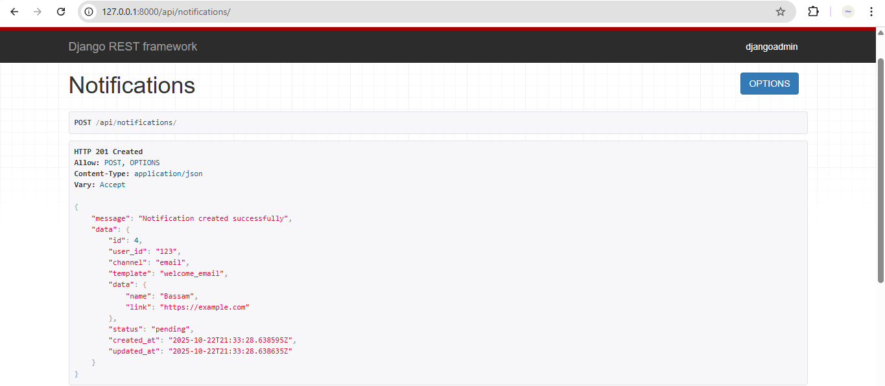

## How to Run the Project Locally

1. Clone the repository
```bash
git clone https://github.com/Afnan112/notification-service.git
cd notification-service
```
2. Install dependencies
```bash
pip install pipenv
pipenv install
pipenv shell
```
3. Apply database migrations
 ```bash
   python manage.py migrate
```
4. Run the server
```bash
python manage.py runserver
```
5. Access the API or admin panel
   - Create notification: POST /api/notifications
   - Check status and details of the notification: GET /api/notifications/:id
   - Django admin (for viewing notifications): http://127.0.0.1:8000/admin/

  
  ## Major Design Decisions

- **Choosing Django + DRF** to build the API instead of another framework, for fast development and built-in REST support.  
- **Using django-q for asynchronous task processing** instead of executing tasks directly in the API. This allows notifications to be queued and processed in the background, reducing wait time for API responses and improving performance.  
- **Organizing models and fields** (Notification, status, data) to make notification management and tracking easier.  
- **Creating a separate status endpoint** to check notifications instead of combining it with the creation endpoint, making it easier to monitor and query notifications.  

## What Could Be Improved or Added With More Time

- Support for additional notification channels, such as WhatsApp or Slack.
- Implement a system to send real messages instead of just simulating them (real emails or SMS).
- Add a simple frontend interface to display the status of notifications to users.

## Result API Request
### Create Notification API


